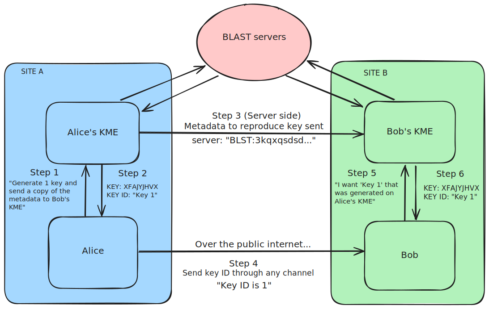

+++
menuTitle = "DQKD"
title = "Digital Quantum Key Distribution (DQKD)  "
date = 2021-12-10T11:01:08-04:00
weight = 2
disableToc = "true"
+++

## What is DQKD?

DQKD is a functional and easy-to-set-up alternative to [QKD](https://www.nsa.gov/Cybersecurity/Quantum-Key-Distribution-QKD-and-Quantum-Cryptography-QC/), aiming to attain the level of security granted by QKD with a fraction of the deployment cost. We do so by using Qrypt's [BLAST](https://www.qrypt.com/wp-content/uploads/2022/03/Whitepaper-EverlastingSecurity.pdf#page=9) technology to generate key material safely at the endpoints. Unlike standard QKD, Qrypt's BLAST-based QKD removes the need for specialized instalations such as satalite and fiber optic.
## How it works:
### From the User Perspective (simplest example)
1. Alice wants to generate symmetric keys with Bob, without sending the key material directly between her and Bob

2. Using her cert from Qrypt, and the ID of Bob's Key Management Entity (KME), Alice calls the API for a single key.

2. A moment later, she recieves the key and respective key ID from her KME on site.

3. Behind the scenes, Alice's KME securely transmits the data required for Bob's KME to generate the exact same key through BLAST. 

4. Then, she comfortably shares the key ID over a public channel with Bob, say over Discord or Whatsapp. Bob recieves the key ID.

5. Bob then sends a request to his KME through the same API to replicate the key. 

6. From his on-site KME, Bob then recieves the key material that was generated by Alice, and can then use that material to send sensitive data to Alice.
See graphic below for a visual. 



Alice and Bob have successfully established a post-quantum cryptographic connection without digging 100's of miles of cable or launching multiple satalites. 
### Technical Implementation Details
Alice requests a fresh quantum-random key, tagging Bob's server to allow dqkd to make the key available on that server. 

    curl --cert My_Cert.p12 \
    "https://dqkd-eastus-1.qrypt.net/api/v1/keys/(Bob's KME ID)/enc_keys"

The API defaults to one key of size 256, because Alice only needs one default key, she leaves the data fields blank, and recieves a key:


    {"keys": [{"key": “actual key”,"key_ID": “key id of actual key”}]}  

{}
To request more than the default, use the following format, by adding the following to the data field of the request:
{}
```c
    curl --cert My_Cert.p12 \
    "https://dqkd-eastus-1.qrypt.net/api/v1/keys/(Bob's KME ID)/enc_keys" \
    -d '{"number": 1,  "size":256}'
```

Alice then sends the key ID to Bob, who already has Alice's KME ID, then sends the request for the Key Alice generated on her end. 

    curl --cert My_Cert.p12 \
    "https://dqkd-westus-1.qrypt.net/api/v1/keys/(Alice's KME ID)/dec_keys" \
    -H "Content-Type: application/json" \
    -d '{"key_IDs": [{"key_ID": “key id of actual key”}]}'

Bob then recieves the same message generated by Alice

    {"keys": [{"key": “actual key”,"key_ID": “key id of actual key”}]}  

From here the key can be used for any number of use cases, with the assurance that the key data is secure. This example is only to show how the system works, there can be any number of Alices or Bobs under a single KME, and unlimited KMEs that communicate with one another in a network. There is also the option to have a Time To Live (TTL) which can time-gate key decodes for shorter than the default of one hour. 

{}
We have implemented Qrypt DQKD in accordance with the [ETSI GS QKD 014](https://www.etsi.org/deliver/etsi_gs/QKD/001_099/014/01.01.01_60/gs_qkd014v010101p.pdf) specification.
{}